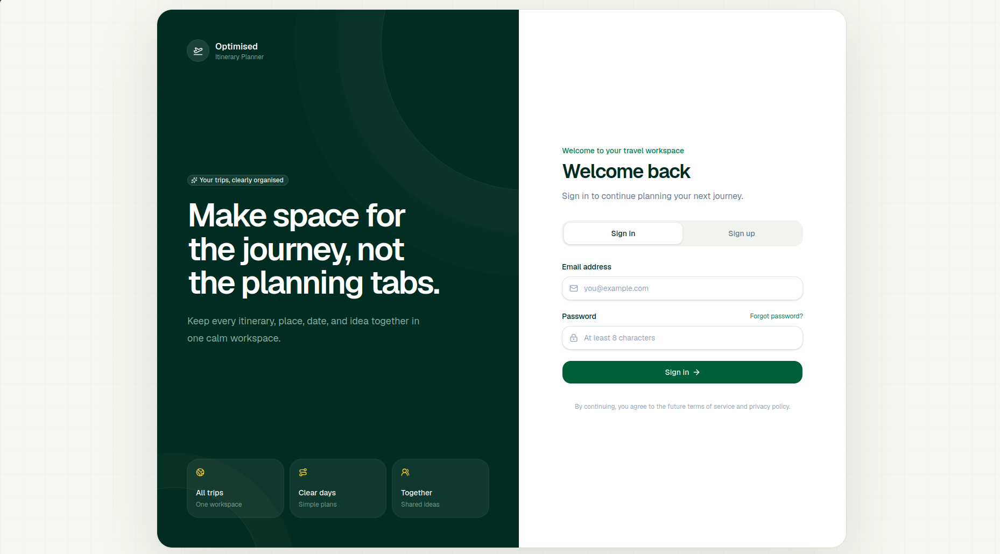
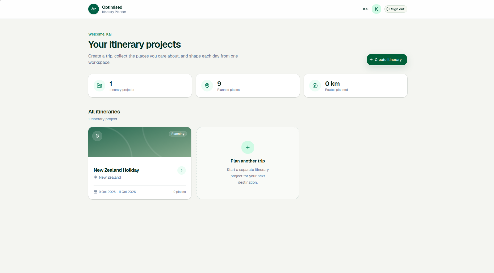
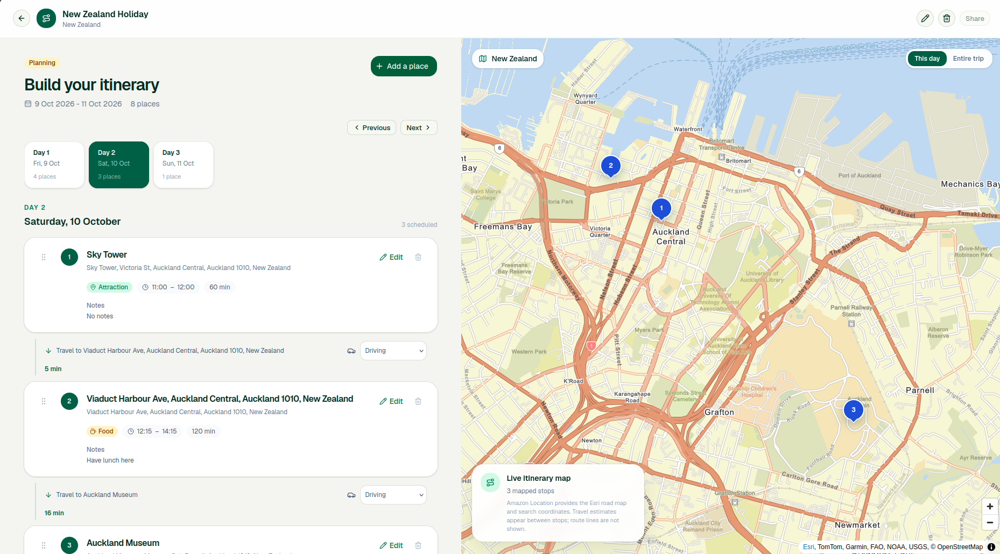

# Optimised Itinerary Planner

A React and TypeScript travel planner built for COMPX527. Create trips, organise daily activities, find places on a map and estimate travel times. Automatic itinerary optimisation is not included.

**The original hosted service has been retired.** There is no public demo or shared AWS account. This release keeps the application and reusable AWS integrations, with setup for your own account.

## Screenshots

These screenshots show the original application with an example itinerary. Running your own version requires the AWS setup below.

### Sign in

Sign in to your account, register as a new user or reset a forgotten password.



### Trip dashboard

View your saved itineraries and their dates, open an existing trip or create a new one.



### Daily planner

Switch between days, add or edit activities and organise their times, categories and notes. Numbered map pins show saved places, with optional travel-time estimates between stops.



## Run locally

Use Node.js 24 LTS and npm. Tests and builds work without AWS. Signing in, saving trips and using maps require your own AWS resources, even when the servers run locally.

```bash
git clone https://github.com/Kai-Meiklejohn/optimised-itinerary-planner.git
cd optimised-itinerary-planner
npm ci
npm ci --prefix backend
cp .env.example .env.local
cp backend/.env.example backend/.env
```

1. Follow [AWS setup](infra/README.md) to create Cognito, DynamoDB and Amazon Location resources in your own account.
2. Fill in the two environment files from the Terraform outputs. Use the same Cognito app client ID in both files. Add a restricted Location browser key for maps and search.
3. Run `npm run dev` in one terminal and `npm run dev --prefix backend` in another.
4. Open **http://localhost:5173**, register and confirm your email, then sign in. Restart the servers after changing configuration.

The backend listens on `127.0.0.1:3001` and accepts the local frontend at `http://localhost:5173`. It uses your AWS profile, not credentials supplied by the browser. Never put AWS access keys or other private credentials in `VITE_` variables because those values are included in the browser bundle.

## Checks

```bash
npm run lint
npm test
npm run build
npm run typecheck --prefix backend
npm test --prefix backend
npm run build --prefix backend
```

Tests use mocked services and do not contact AWS. GitHub Actions runs these checks and validates Terraform without cloud credentials. It does not deploy anything.

## How it works

The React frontend uses Cognito for accounts and Amazon Location for maps, search and optional travel estimates. The local Node.js backend verifies the user's token, checks trip ownership and saves data to DynamoDB. Saved place details are resolved through Amazon Location Places v2. MapLibre renders the map in the browser.

The backend also includes a Lambda handler for developers who want to build their own hosted deployment. The retired hosting configuration and automatic deployment workflows are not included. You must configure authentication, HTTPS and service permissions for any deployment you create.

## Documentation

- [AWS resources and configuration](infra/README.md)
- [Activity editing and scheduling](docs/activity-editing.md)
- [Security and reporting vulnerabilities](SECURITY.md)
- [Contributing](CONTRIBUTING.md)

## Licence and credits

[MIT](LICENSE). Originally developed by Kai Meiklejohn, Ashtar, Phuoc, Chathurangi and Riley for COMPX527. Third-party packages and Amazon Location data retain their own licences and terms.
